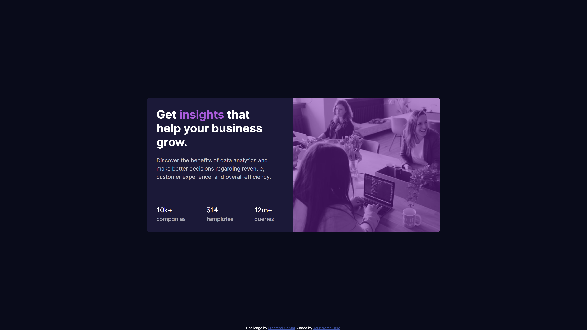

# Frontend Mentor - Stats preview card component

Note: The photo above is the design preview for the challenge. The actual preview of my project can be seen below.

## Welcome! 👋

Thanks for checking out this front-end coding challenge.
This is a simple web application showcasing my command of HTML and CSS.

## The challenge

This is one of the challenges that makes me wish I had the design's exact measurements for the elements. It was really hard to eyeball these measurement since the elements
in the layouts and their corresponding spacings varies from each other.

## My solution

I started the challenge by creating two cards on top of each other with the mobile design in mind. The layout in this part is pretty simple. On the bigger screens,
I combined these two cards into a single main card by using display flex and media query. I didn't have the exact measurements so I eyeballed the layout which is the hardest
part of this challenge. Having said that, I settled with the measurements that I think is appropriate to the screen size.

## Technologies used

- HTML - Used to create the index.html file
- CSS - Used to design the webpage
- VSCode - IDE I used to create the web app
- Git - For version control
- Netflify - Used to host this web app

## Preview

## Deployment

You may visit the deployed web app through the link below.

- [https://github.com/rgel25/stats-preview-card-component-main](https://github.com/rgel25/stats-preview-card-component-main)

## Footer

Thank you for taking the time in checking out this repository.

**Argel Miralles | Full Stack Web Developer** 
**SIC PARVIS MAGNA**☝
